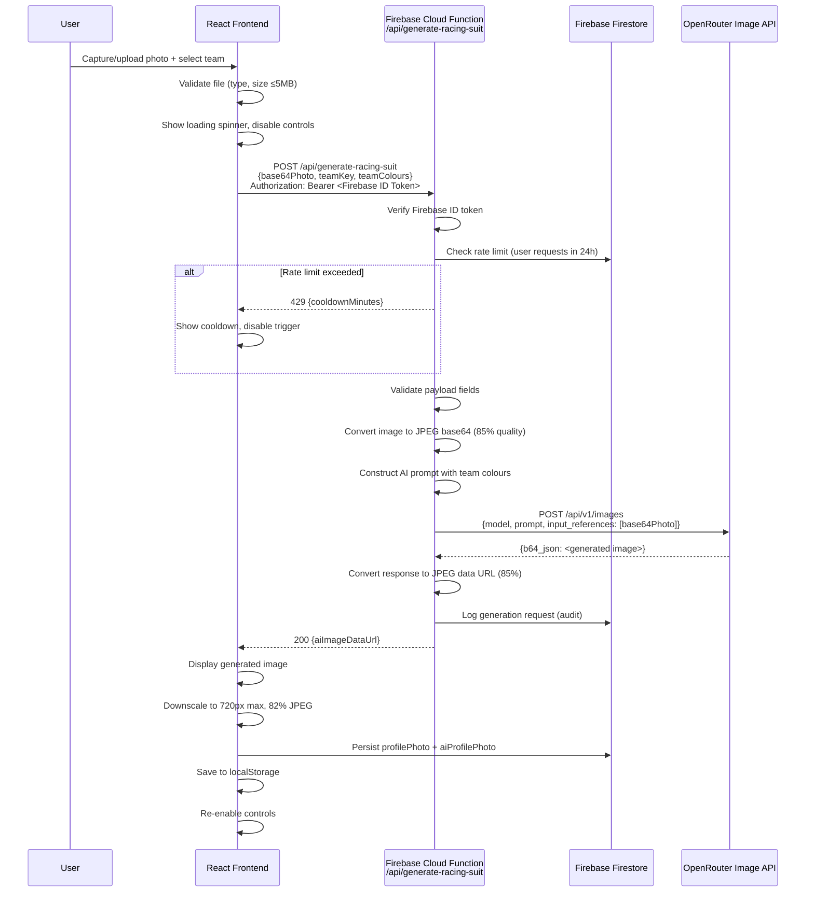
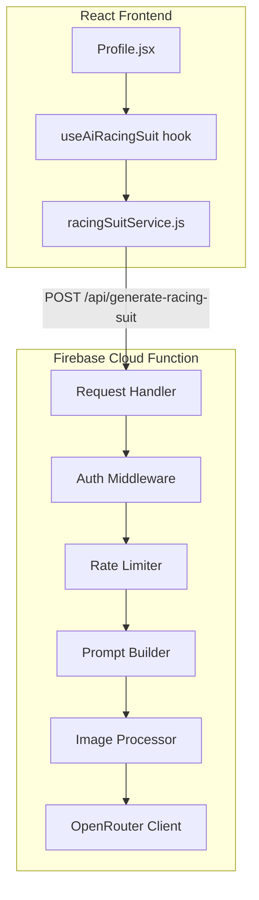
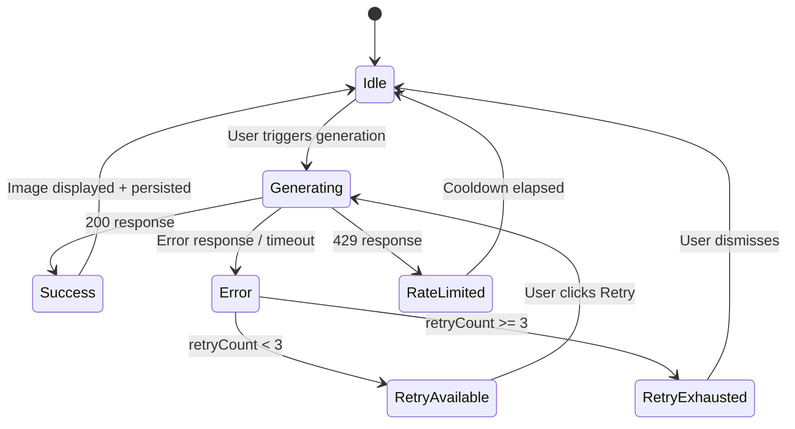

# Design Document: AI Racing Suit Profile

## Overview

This feature replaces the existing canvas-based "AI Racing Suit" overlay on the Profile page with real AI-powered image generation via the OpenRouter Image API. The current implementation uses simple canvas drawing (gradient fills and geometric shapes) to simulate a racing suit. The new approach sends the user's profile photo to an AI image generation model through a secure backend proxy, producing a photorealistic composite of the user wearing their selected F1 team's racing suit.

The system follows a client-server architecture where:
- The **frontend** (React/Vite) handles photo capture/upload, displays loading states, manages local + Firestore persistence, and validates file inputs
- A **backend proxy** (Firebase Cloud Function) authenticates requests, enforces rate limits, constructs the AI prompt, calls the OpenRouter Image API, and returns the result
- The **OpenRouter Image API** performs the actual AI image generation using the `input_references` feature for image-to-image transformation

Key design decisions:
- **Backend proxy pattern**: The operator's OpenRouter API key is stored exclusively in server-side environment variables and never exposed to the client
- **Rolling window rate limiting**: Per-user rate limiting (10 requests/24h) is stored in Firestore to persist across function cold starts
- **Dual persistence**: Images are stored in both Firestore and localStorage, with localStorage as fallback if Firestore write fails
- **Frontend timeout < Backend timeout**: The frontend aborts at 30s for UX responsiveness, while the backend allows up to 90s for the upstream OpenRouter call

## Architecture



### Component Architecture



## Components and Interfaces

### Backend Components

#### 1. Request Handler (`functions/src/generateRacingSuit.js`)

The main Cloud Function entry point. Receives HTTP requests, orchestrates the middleware pipeline, and returns responses.

```javascript
// POST /api/generate-racing-suit
// Request body:
{
  base64Photo: string,   // Base64-encoded image data URL
  teamKey: string,       // e.g. "ferrari", "mercedes"
  teamColours: {
    primary: string,     // Hex colour e.g. "#E10600"
    secondary: string,   // Hex colour
    accent: string       // Hex colour
  }
}

// Response (success):
{ aiImageDataUrl: string }  // Base64 JPEG data URL

// Response (error):
{ error: { code: string, message: string } }
```

#### 2. Auth Middleware (`functions/src/middleware/auth.js`)

Verifies Firebase ID tokens from the `Authorization: Bearer <token>` header using Firebase Admin SDK.

```javascript
// Input: request with Authorization header
// Output: decoded token with uid, or 401 error
async function verifyAuth(req) → { uid: string } | Error(401)
```

#### 3. Rate Limiter (`functions/src/middleware/rateLimiter.js`)

Enforces the 10 requests per user per 24-hour rolling window. Uses Firestore collection `generationLogs` to track request timestamps.

```javascript
// Input: userId
// Output: { allowed: boolean, cooldownMinutes?: number }
async function checkRateLimit(userId) → { allowed, cooldownMinutes? }
```

#### 4. Prompt Builder (`functions/src/services/promptBuilder.js`)

Constructs the text prompt sent to the OpenRouter Image API, incorporating team name, colours, and instructions to preserve the user's face/head/hair.

```javascript
// Input: teamKey, teamColours
// Output: prompt string
function buildPrompt(teamKey, teamColours) → string
```

#### 5. Image Processor (`functions/src/services/imageProcessor.js`)

Handles image format conversion. Decodes incoming base64, validates it's a supported image, converts to JPEG at 85% quality, and ensures payload size is under 5MB.

```javascript
// Input: base64 data URL (any supported format)
// Output: base64 JPEG data URL at 85% quality, ≤5MB
async function preprocessImage(base64DataUrl) → string | Error(400)

// Input: base64 from OpenRouter response
// Output: base64 JPEG data URL at 85% quality
function postprocessImage(b64Json) → string
```

#### 6. OpenRouter Client (`functions/src/services/openRouterClient.js`)

Sends the generation request to OpenRouter's Image API with a 90-second timeout. Uses the operator's API key from environment variables.

```javascript
// Input: prompt string, base64 JPEG reference image
// Output: base64-encoded generated image
async function generateImage(prompt, base64Reference) → string | Error
```

### Frontend Components

#### 7. Racing Suit Service (`frontend/src/services/racingSuitService.js`)

Handles the HTTP call to the backend proxy with Firebase Auth token, 30-second timeout via AbortController, and error normalization.

```javascript
// Input: base64Photo, teamKey, teamColours, firebaseUser
// Output: aiImageDataUrl or throws with error code/message
async function generateRacingSuit({ base64Photo, teamKey, teamColours, user }) → string
```

#### 8. useAiRacingSuit Hook (`frontend/src/hooks/useAiRacingSuit.js`)

Custom React hook encapsulating generation state management: loading, error, retry count, cooldown timer, and the generate/retry actions.

```javascript
function useAiRacingSuit(user) → {
  isGenerating: boolean,
  error: { code: string, message: string } | null,
  cooldownMinutes: number | null,
  retryCount: number,
  canRetry: boolean,
  generate: (base64Photo, teamKey, teamColours) => Promise<string | null>,
  retry: () => Promise<string | null>,
  clearError: () => void
}
```

#### 9. Profile.jsx (Modified)

The existing Profile page component, updated to:
- Use `useAiRacingSuit` hook instead of `buildAiOutfitImage`
- Display loading spinner overlay on the AI Racing Suit slot
- Show estimated wait time message
- Disable camera/upload/team controls during generation
- Show retry button on failure (max 3 attempts)
- Display cooldown timer when rate-limited

## Data Models

### Firestore Collections

#### `users` collection (existing, extended)

```javascript
{
  // ... existing fields ...
  profilePhoto: string,        // Base64 JPEG data URL of original photo
  aiProfilePhoto: string,      // Base64 JPEG data URL of AI-generated image
  favoriteTeam: string,        // Team key e.g. "ferrari"
  // Removed fields (migration):
  // profileImageOriginal, profileImageAi → consolidated to above
}
```

#### `generationLogs` collection (new)

Used for rate limiting and auditing.

```javascript
{
  userId: string,              // Firebase Auth UID
  timestamp: Timestamp,        // Server timestamp of request
  outcome: "forwarded" | "rejected",  // Whether request was sent to OpenRouter
  teamKey: string,             // Team requested
  modelCost: number | null,    // USD cost from OpenRouter usage response
  errorCode: string | null     // Error code if generation failed
}
```

### localStorage Schema

Key pattern: `f1ProfilePrefs:{username}`

```javascript
{
  favoriteTeam: string,
  profilePhoto: string,        // Base64 JPEG data URL
  aiProfilePhoto: string       // Base64 JPEG data URL
}
```

### Request/Response Types

#### Generation Request (Frontend → Backend)

```javascript
{
  base64Photo: string,         // Full data URL: "data:image/jpeg;base64,..."
  teamKey: string,             // One of TEAM_THEMES keys
  teamColours: {
    primary: string,           // Hex colour
    secondary: string,         // Hex colour  
    accent: string             // Hex colour
  }
}
```

#### Generation Response (Backend → Frontend)

```javascript
// Success (200):
{ aiImageDataUrl: string }

// Auth Error (401):
{ error: { code: "AUTH_FAILED", message: string } }

// Validation Error (400):
{ error: { code: "INVALID_PAYLOAD", message: string, fields: string[] } }

// Rate Limited (429):
{ error: { code: "RATE_LIMITED", message: string, cooldownMinutes: number } }

// Content Moderation (422):
{ error: { code: "CONTENT_MODERATION", message: string } }

// Upstream Error (502):
{ error: { code: "UPSTREAM_ERROR", message: string } }

// Service Unavailable (503):
{ error: { code: "SERVICE_UNAVAILABLE", message: string } }
```

### OpenRouter API Request

```javascript
// POST https://openrouter.ai/api/v1/images
{
  model: string,               // Configured via env, e.g. "openai/gpt-image-1"
  prompt: string,              // Constructed by promptBuilder
  resolution: "1K",            // Minimum 512x512
  quality: "medium",
  output_format: "jpeg",
  input_references: [{
    type: "image_url",
    image_url: {
      url: string              // "data:image/jpeg;base64,..."
    }
  }]
}
```


## Correctness Properties

*A property is a characteristic or behavior that should hold true across all valid executions of a system — essentially, a formal statement about what the system should do. Properties serve as the bridge between human-readable specifications and machine-verifiable correctness guarantees.*

### Property 1: Payload Validation Correctness

*For any* Generation_Request payload where one or more required fields (base64Photo, teamKey, teamColours.primary, teamColours.secondary, teamColours.accent) are missing or empty, the validation function SHALL return a 400 error response containing exactly the set of missing/invalid field names, and SHALL NOT forward the request to the OpenRouter API.

**Validates: Requirements 1.5, 2.6**

### Property 2: Prompt Construction Contains All Team Information

*For any* valid team key and team colours object (with primary, secondary, and accent hex colours), the constructed prompt string SHALL contain the team label, the primary colour value, the secondary colour value, and the accent colour value as substrings.

**Validates: Requirements 2.1, 2.2**

### Property 3: Error Response Never Leaks API Key

*For any* OpenRouter API error response (regardless of content), the backend proxy's returned error response body, when serialized to a string, SHALL NOT contain the OpenRouter API key string or any substring of the API key longer than 4 characters.

**Validates: Requirements 1.8**

### Property 4: Frontend File Validation

*For any* file with a MIME type in {image/jpeg, image/png, image/webp} AND size ≤ 5MB, the frontend validation function SHALL accept the file. *For any* file with a MIME type NOT in that set OR size > 5MB, the validation function SHALL reject the file and return an error indicating the specific constraint violated (type or size).

**Validates: Requirements 3.1, 3.7**

### Property 5: Rate Limiter Enforces Rolling Window

*For any* user with a sequence of generation request timestamps, the rate limiter SHALL allow the request if and only if fewer than 10 requests have been forwarded within the preceding 24-hour window. When rejected, the cooldown time SHALL equal the ceiling of the time remaining until the oldest qualifying request falls outside the 24-hour window, expressed in whole minutes with a minimum of 1.

**Validates: Requirements 5.1, 5.2**

### Property 6: Retry Counter Disables After Threshold

*For any* sequence of consecutive generation failures, the retry mechanism SHALL allow retry when the consecutive failure count is less than 3, and SHALL disable retry (canRetry = false) when the count reaches 3 or more. A successful generation SHALL reset the counter to 0.

**Validates: Requirements 7.5**

### Property 7: Image Preprocessing Format Conversion

*For any* valid image input (decodable as JPEG, PNG, or WebP), the preprocessing function SHALL produce a base64 data URL with the prefix "data:image/jpeg;base64,". *For any* input that cannot be decoded as a valid image, the preprocessing function SHALL throw an error indicating unsupported format.

**Validates: Requirements 8.1, 8.6**

### Property 8: Frontend Downscale Constraints

*For any* input image with arbitrary dimensions, the downscale function SHALL produce an output where: (a) the maximum dimension (width or height) is ≤ 720 pixels, (b) the aspect ratio is preserved (within ±1 pixel rounding), and (c) the output is a JPEG data URL.

**Validates: Requirements 8.5**

## Error Handling

### Backend Error Handling Strategy

| Error Source | HTTP Status | Error Code | User-Facing Message |
|---|---|---|---|
| Missing/invalid Firebase token | 401 | `AUTH_FAILED` | "Authentication required. Please sign in again." |
| Missing required payload fields | 400 | `INVALID_PAYLOAD` | "Missing required fields: {fieldList}" |
| Invalid image data (not decodable) | 400 | `INVALID_IMAGE` | "The uploaded file is not a supported image format." |
| Image payload too large (>5MB after conversion) | 400 | `IMAGE_TOO_LARGE` | "Image is too large. Please use a smaller photo." |
| Rate limit exceeded | 429 | `RATE_LIMITED` | "Rate limit reached. Try again in {minutes} minutes." |
| Rate-limit storage unavailable | 503 | `SERVICE_UNAVAILABLE` | "Service temporarily unavailable. Please try again later." |
| OpenRouter content moderation rejection | 422 | `CONTENT_MODERATION` | "Photo could not be processed due to content policy." |
| OpenRouter API error (non-moderation) | 502 | `UPSTREAM_ERROR` | "Image generation service is temporarily unavailable." |
| OpenRouter timeout (>90s) | 504 | `UPSTREAM_TIMEOUT` | "Image generation took too long. Please try again." |

### Frontend Error Handling Strategy

| Scenario | Action | UI Feedback |
|---|---|---|
| Network unreachable / connection timeout (10s) | Abort request | Inline error: "Service unavailable. Try again later." + Retry button |
| Request timeout (30s frontend abort) | AbortController.abort() | Error: "Request timed out." + Retry button |
| 401 response | Redirect to re-auth or prompt sign-in | Error: "Session expired. Please sign in." |
| 400 response | Show validation error | Error with specific field/format issue |
| 422 content moderation | Show policy message | "Photo could not be processed due to content policy." |
| 429 rate limited | Start cooldown timer | "Rate limit reached. Try again in X minutes." + disabled trigger |
| 502/503/504 upstream | Show transient error | "Service temporarily unavailable." + Retry button |
| Retry limit (3 consecutive) | Disable retry | "Multiple attempts failed. Please try again later." |
| Firestore persistence failure | Fallback to localStorage | Warning: "Saved locally. Cloud sync failed." |

### Error Recovery Flow



## Testing Strategy

### Property-Based Tests (using fast-check)

The project will use [fast-check](https://github.com/dubzzz/fast-check) as the property-based testing library for JavaScript/Node.js. Each property test will run a minimum of 100 iterations.

| Property | Target Module | Generator Strategy |
|---|---|---|
| P1: Payload Validation | `functions/src/middleware/validatePayload.js` | Generate random subsets of required fields, including empty strings, null values, and missing keys |
| P2: Prompt Construction | `functions/src/services/promptBuilder.js` | Generate random team keys, hex colour strings, team labels |
| P3: API Key Leak Prevention | `functions/src/generateRacingSuit.js` (error handler) | Generate random error payloads potentially containing the API key |
| P4: File Validation | `frontend/src/services/fileValidator.js` | Generate random MIME types and file sizes across valid/invalid ranges |
| P5: Rate Limiter | `functions/src/middleware/rateLimiter.js` | Generate sequences of timestamps within/outside 24h windows |
| P6: Retry Counter | `frontend/src/hooks/useAiRacingSuit.js` | Generate sequences of success/failure outcomes |
| P7: Image Preprocessing | `functions/src/services/imageProcessor.js` | Generate valid image buffers in different formats + invalid binary data |
| P8: Downscale Constraints | `frontend/src/services/imageDownscaler.js` | Generate random image dimensions (1x1 to 10000x10000) |

Configuration:
- Minimum 100 iterations per property
- Each test tagged with: `Feature: ai-racing-suit-profile, Property {N}: {description}`

### Unit Tests (Example-Based)

| Area | Test Cases |
|---|---|
| Auth middleware | Valid token passes, missing token → 401, expired token → 401, malformed token → 401 |
| Prompt construction | Prompt includes face preservation language, torso replacement instruction, branding elements |
| Loading state | Controls disabled during generation, spinner visible, re-enabled on complete/error |
| Team change | Triggers regeneration when photo exists, skips when no photo |
| Persistence | Writes to Firestore + localStorage on success, falls back to localStorage on Firestore failure |
| Timeout | Frontend aborts at 30s, shows timeout message |
| Content moderation | 422 shows content policy message distinct from generic errors |
| Cooldown | Timer displays minutes, controls re-enable after expiry |

### Integration Tests

| Scenario | Approach |
|---|---|
| End-to-end generation flow | Mock OpenRouter API, verify full pipeline from request to persisted image |
| Rate limit persistence | Verify Firestore writes in `generationLogs` and correct count enforcement |
| Auth + rate limit + generation | Full middleware chain with mock external dependencies |
| Team change regeneration | Simulate team switch, verify new request sent with updated colours |

### Test Setup

- **Backend tests**: Vitest with Firebase Admin SDK mocked, OpenRouter client mocked
- **Frontend tests**: Vitest + React Testing Library, Firebase SDK mocked
- **Property tests**: fast-check integrated with Vitest
- **Test command**: `vitest --run` (single execution, no watch mode)
